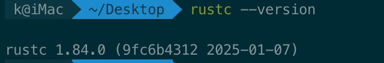
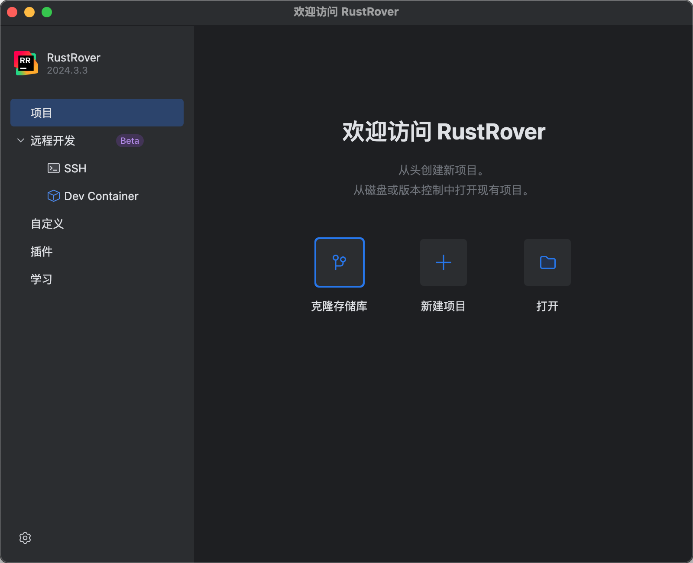

solana智能合约开发可以用到多种语言，但是目前生态最广的，以及官方最推荐的还是rust语言。

本章节讲解基础环境的搭建。

# rust安装

rust官网链接: https://www.rust-lang.org/tools/install

Mac/Linux 安装方法：`curl --proto '=https' --tlsv1.2 -sSf https://sh.rustup.rs | sh`

Windows安装请参考:  https://forge.rust-lang.org/infra/other-installation-methods.html

安装成功后，执行 `rustc --version`,显示版本号说明安装成功

# RustRover安装

rust搭配rustrover作为开发工具效率更高，目前rustrover有免费一年的非商用许可

下载链接: https://www.jetbrains.com/rust/download/

出现如下界面，说明安装启动成功

