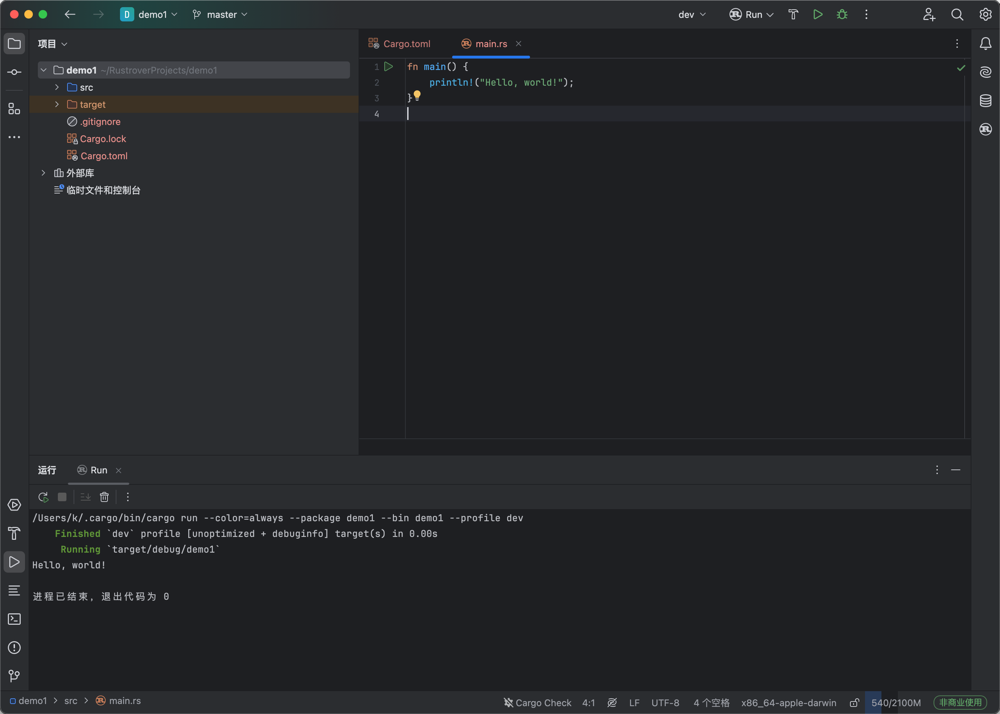

# 创建项目

点击创建项目，来新建一个项目


选择二进制程序


点击右上角的运行，即可启动我们的第一个rust项目



# 基础语法

在rust中是通过main函数作为程序的入口点。

## 变量

定义变量，关键字与js的类似，通过let来进行定义

```
let a = 123;
```

但是因为rust强安全的需求，默认定义的变量是不可修改的。

直接在代码中给a再次赋值，编译不会通过

```rust
error[E0384]: cannot assign twice to immutable variable `a`
 --> src/main.rs:3:5
  |
2 |     let a = 123;
  |         - first assignment to `a`
3 |     a = 345;
  |     ^^^^^^^ cannot assign twice to immutable variable
  |
help: consider making this binding mutable
  |
2 |     let mut a = 123;
  |         +++
```

需要变量可变，需要使用mut关键字修饰,以下代码可正常执行

```rust
fn main() {
    let mut a = 123;
    a = 345;
    println!("Hello, world!");
}
```

rust中常用的变量类型有:

- **整数类型**:
    - 有符号整数: `i8`, `i16`, `i32`, `i64`, `i128`, `isize`
    - 无符号整数: `u8`, `u16`, `u32`, `u64`, `u128`, `usize`

- **浮点数类型**:

    - `f32`, `f64`

- **布尔类型**:

    - `bool` (`true` 或 `false`)

- 字符串

    - `String::from("Hello")`

- 结构体

    ```rust
    struct Point {
        x: i32,
        y: i32,
    }
    ```

- 枚举

```rust
enum Direction {
    North,
    South,
    East,
    West,
}
```

使用let可以自动推导变量的类型，但是如果需要强制指定变量类型，可以通过如下语法:

`let a: u64 = 123;`

## 作用域

在rust，不允许在函数外部通过let来声明变量,下面的代码是不合法的。

```
let  a = 123;
fn main(
    
) {}
```

想要声明全局，可以使用 `static` 关键字声明全局变量。

#### 不可变的全局变量

```
static GLOBAL: i32 = 100; // 不可变的全局变量

fn main() {
    println!("GLOBAL: {}", GLOBAL); // 可以在函数中访问
}
```

#### 可变的全局变量

```
static mut COUNTER: i32 = 0; // 可变的全局变量

fn main() {
    unsafe {
        COUNTER += 1; // 修改可变全局变量需要 unsafe 块
        println!("COUNTER: {}", COUNTER);
    }
}
```

或者可以声明一个常量

```
const MAX_POINTS: u32 = 100_000; // 常量
```

## 常量

常量使用const关键字来进行定义，

```rust
const c: i32 = 123;
```

如果赋值，会报错

```
error[E0070]: invalid left-hand side of assignment
 --> src/main.rs:8:7
  |
8 |     c = 123;
  |     - ^
  |     |
  |     cannot assign to this expression
```

常量与没有使用mut修饰的变量一样，都无法改变它的值，但是不一样的是变量可以被重新声明，常量不可以

```
fn main() {
    let  a = 123;
    let  a = 456;

    const c: i32 = 123;
    const c: i32 = 123; //会抛出错误

    println!("Hello, world!");
}
```

## 函数声明

通过fn声明函数，`:`来声明参数的类型，`->`来声明返回值的类型，与python的语法类似

```rust
fn a(a: i32, b: i32) -> i32 {
    return a + b;
}
```

## 循环

### loop循环

无限循环，直到显式使用 `break` 退出,等效与python中的`while True`

```rust
loop {
    println!("This will print forever!");
    break; // 退出循环
}
```

### while  循环

`while` 循环在条件为 `true` 时继续执行

```rust
let mut count = 0;
while count < 5 {
    println!("Count: {}", count);
    count += 1;
}
```

### for 循环

`for` 循环用于遍历集合或范围。

```rust
for i in 0..5 {
    println!("i: {}", i);
}

let arr = [10, 20, 30];
for element in arr.iter() {
    println!("Element: {}", element);
}
```

## 结构体

结构体既可以声明在函数外，也可以在函数中声明

```rust
struct UserA {
    username: String,
}

fn main() {
    struct UserB {
        username: String,
    }
    //初始化一个结构体
    let user1 = UserA {
        username: String::from("abc"), 
    };
}

```

