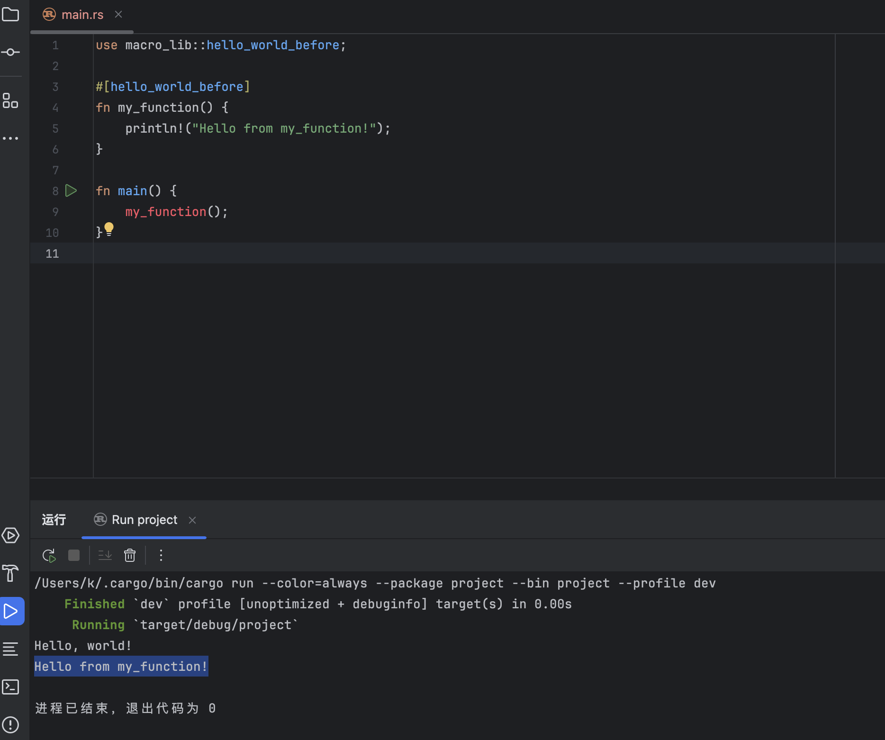

本章节讲解一下rust中的进阶语法

# 导入模块

```
use std::cmp::min;
```

在 Rust 中，`use std::cmp::min;` 是一种导入语句，用于将 `std::cmp` 模块中的 `min` 函数引入当前作用域

类似于Python中的`form xx import xx`

# 模块设计

rust中模块用于复用代码。有两种写法,一种方法是可以直接写在同一个文件中,但是Rust 默认所有项（函数、结构体等）是私有的，只有通过 `pub` 关键字显式标记为公开的项才能被外部访问。

```rust
mod my_module {
    pub fn hello() {
        println!("Hello from my_module!");
    }
}

fn main() {
    my_module::hello();
}
```

还有一种方法就是写到文件中，Rust 会自动查找 `my_module.rs` 文件并将其内容作为模块加载

```rust
// my_module.rs
pub fn hello() {
    println!("Hello from my_module!");
}
```

```rust
//main.rs
mod my_module;

fn main() {
    my_module::hello();
}
```

# 属性

在下面的代码中`#[derive(Debug)]`,就是rust中的属性，有点类似于java中的注解

`#[derive(Debug)]`是rust官方自带的属性，用于打印结构体或枚举的内容，方便调试

```rust
#[derive(Debug)]
struct Point {
    x: i32,
    y: i32,
}

fn main() {
    let p = Point { x: 1, y: 2 };
    println!("{:?}", p);
}
```

Java 注解主要用于标记和配置，通常需要通过反射在运行时处理。

Rust 属性更强大，可以直接影响编译器的行为（如条件编译、代码生成等），并且可以通过过程宏实现自定义逻辑。

我们自己来实现一个 在函数执行前输出一个`hello world`的自定义属性

```rust
cargo new project
cd project
cargo new macro_lib --lib
```


macro_lib/Cargo.toml

```yaml
[package]
name = "macro_lib"
version = "0.1.0"
edition = "2021"

[dependencies]
quote = "1.0.38"
syn = { version = "2.0", features = ["full"] }
[lib]
proc-macro = true
```

macro_lib/src/lib.rs

```rust
// macro_lib/src/log_duration.rs

use proc_macro::TokenStream;
use quote::quote;
use syn::{parse_macro_input, ItemFn};

#[proc_macro_attribute]
pub fn hello_world_before(_attr: TokenStream, item: TokenStream) -> TokenStream {
    // 解析输入的函数
    let input = parse_macro_input!(item as ItemFn);

    // 获取函数名、输入参数和函数体
    let fn_name = &input.sig.ident;
    let fn_inputs = &input.sig.inputs;
    let fn_block = &input.block;

    // 生成新的代码
    let expanded = quote! {
        // 保留原始函数
        fn #fn_name(#fn_inputs) {
            // 在函数执行前输出 "Hello, world!"
            println!("Hello, world!");
            // 执行原始函数体
            #fn_block
        }
    };

    // 返回生成的代码
    TokenStream::from(expanded)
}

```

src/main.rs

```rust
use macro_lib::hello_world_before;

#[hello_world_before]
fn my_function() {
    println!("Hello from my_function!");
}

fn main() {
    my_function();
}

```



# 宏

在 Rust 中，函数名以 `!` 结尾通常表示这是一个**宏**，而不是普通函数。`println!()` 就是一个宏。

Rust 的宏允许你在编译时生成和操作代码。Rust 的宏分为两种主要类型：**声明宏**（Declarative Macros）和**过程宏**（Procedural Macros）

## 声明宏

```rust
macro_rules! my_macro {
    // 模式匹配
    ($x:expr) => {
        println!("The value is: {}", $x);
    };
    // 多个模式
    ($x:expr, $y:expr) => {
        println!("The values are: {} and {}", $x, $y);
    };
}

fn main() {
    my_macro!(10);          // 输出: The value is: 10
    my_macro!(10, 20);      // 输出: The values are: 10 and 20
}
```

### 过程宏

过程宏是更高级的宏，允许你在编译时执行任意代码来生成或转换代码,刚刚解释到的属性就属于一种过程宏

```
use proc_macro::TokenStream;
use quote::quote;

#[proc_macro]
pub fn my_function_macro(input: TokenStream) -> TokenStream {
    let input = input.to_string();
    let expanded = quote! {
        println!("Input was: {}", #input);
    };

    TokenStream::from(expanded)
}

fn main() {
    my_function_macro!(hello);  // 输出: Input was: hello
}
```

# 所有权

Rust 的所有权系统基于以下三条规则：

1. **每个值都有一个所有者**：值在任意时刻只能有一个变量作为其所有者。
2. **值在任意时刻只能有一个所有者**：不能有多个变量同时拥有同一个值。
3. **当所有者离开作用域时，值会被自动释放**：Rust 会自动调用 `drop` 函数来释放内存。

在其他语言中,下列代码都是非常正常的代码。

但是在rust中是无法编译的，因为当将一个变量赋值给另一个变量时，所有权会**移动**到新的变量，原变量将失效

```rust
fn main() {
    let s1 = String::from("hello");
    let s2 = s1; // s1 的所有权移动到 s2
    println!("{}", s1); // 错误：s1 已失效
}
```

如果确实需要复制值而不是移动所有权，需要使用 `clone` 方法

```rust
fn main() {
    let s1 = String::from("hello");
    let s2 = s1.clone(); // s1 的所有权移动到 s2
    println!("{}", s1); // 错误：s1 已失效
}
```

再看一个例子:

```rust
fn main() {
    let s1 = String::from("hello");
    let len = calculate_length(s1);
    println!("{}", len);
    println!("{}", s1); // 错误：s1 已失效
}

fn calculate_length(s: String) -> usize {
    s.len()
}
```

这个例子在其他语言中也是合法的，但是在rust中，

- 当变量进入作用域时，它成为值的所有者。

- 当变量离开作用域时，值会被自动释放。

s1进入了calculate_length的作用域，calculate_length成为了s1的所有者，离开calculate_length函数的时候，s1自动释放，所以无法编译。

这个问题我们除了使用clone来解决，还可以使用借用。

- **不可变引用**：允许多个不可变引用同时存在。
- **可变引用**：同一时间只能有一个可变引用，且不能与不可变引用共存。
- 引用必须始终有效（不能悬空）。

不可变引用

```rust
fn main() {
    let s1 = String::from("hello");
    let len = calculate_length(&s1);
    println!("{}", len);
    println!("{}", s1); // 错误：s1 已失效
}

fn calculate_length(s: &String) -> usize {
    s.len()
}
```

可变引用

```rust
fn increment(num: &mut i32) {
    *num += 1;
}

fn main() {
    let mut x = 5;
    increment(&mut x); // 传递可变引用给函数

    println!("{}", x); // 输出 6
}
```

